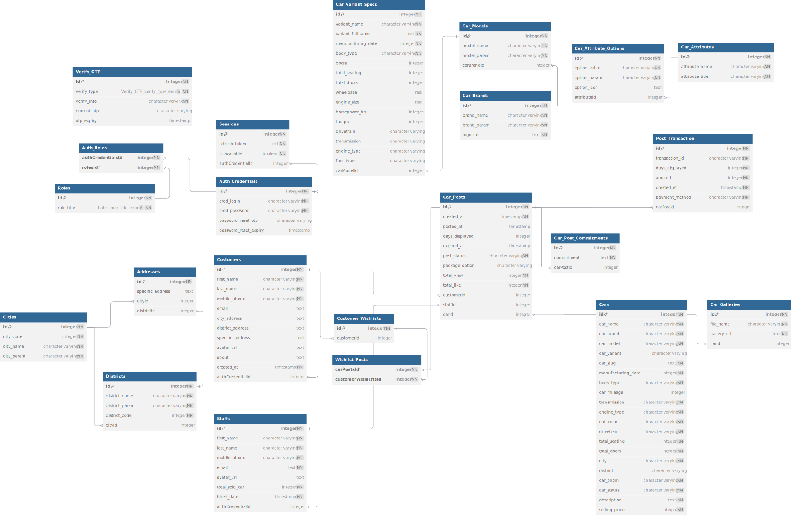

## ExchangeCar Backend Appication
ExchangeCar is a platform designed for creating and managing car-related posts. Also, this project is part of a graduation thesis, showcasing a practical application of API development and web platform creation.

- User Management: Secure user authentication using OTP-based sign-up and login, along with features for password management and profile updates.

- Post Management: Users can draft, publish, update, and delete posts about cars. Each post can include details such as car brand, model, manufacturing year, description, images, and location.

- Search and Filter: The platform enables users to search and filter posts based on criteria like brand, model, city, and other car attributes to find relevant content easily.

- Wishlist and Favorites: Users can save posts to their wishlist, allowing them to easily access and track posts they are interested in.

## How to Run
### Prerequisites
- Node v20

- ```Docker``` installed

- [AWS](https://aws.amazon.com/free/) account for S3

- [Twilio](https://www.twilio.com/en-us) account for SMS API

- [Groq](https://groq.com/) account for LLM-based generation 

- ```ngrok``` installed to expose the IPN URL for MoMo payments in a development environment

- Linux/MacOS, or Windows with WSL2, should have ```make``` installed

### Launch Postgres container
```
make postgres
```

### Create database
```
make createdb
```

### Create unaccent extension for database
```
make unaccent
```

### Seed mock data
*You need to seed mock data from '/docs/mock_data' into database*
```
make seed
```

### Using ngrok to expose the IPN URL for MoMo payments in a development environment
```
ngrok http 8080
```

### Run server
.env
```
PORT=<"the port on which the application server will run">

POSTGRES_HOST=<"the hostname or IP address of the PostgreSQL server">
POSTGRES_PORT=<"the port number on which PostgreSQL is running">
POSTGRES_USERNAME=<"the username used to authenticate with the PostgreSQL database">
POSTGRES_PASSWORD=<"the password for the PostgreSQL user">
POSTGRES_DATABASE_NAME=<"the name of the PostgreSQL database to connect to">

JWT_ACCESS_TOKEN_EXPIRATION_TIME=<"the expiration time for JWT access tokens (e.g., '15m' for 15 minutes)">
JWT_REFRESH_TOKEN_EXPIRATION_TIME=<"the expiration time for JWT refresh tokens (e.g., '7d' for 7 days)">
OTP_EXPIRY_DURATION=<"the duration for which an OTP remains valid (e.g., '5m' for 5 minutes)">

ADMIN_FIRST_NAME=<"the first name of the initial admin user">
ADMIN_LAST_NAME=<"the last name of the initial admin user">
ADMIN_PHONE_NUMBER=<"the phone number of the initial admin user for contact or verification">
ADMIN_EMAIL=<"the email address of the initial admin user for login and communication">
ADMIN_PASSWORD=<"the password for the initial admin user account">

HASHING_SALT=<"the salt value used for hashing passwords, providing added security">

AWS_BUCKET_NAME=<"the name of the AWS S3 bucket used for storing files (e.g., images)">
AWS_BUCKET_REGION=<"the region where the AWS S3 bucket is hosted">
AWS_BUCKET_ACCESS_KEY=<"the access key for authenticating with AWS S3 services">
AWS_BUCKET_SECRET_KEY=<"the secret key for authenticating with AWS S3 services">

MOMO_PARTNER_CODE=<"the partner code provided by MoMo for integrating payments">
MOMO_PAYMENT_ACCESS_KEY=<"the access key provided by MoMo for payment API authentication">
MOMO_PAYMENT_SECRET_KEY=<"the secret key provided by MoMo for secure payment transactions">
IPN_URL=<"the URL for Instant Payment Notification (IPN) to receive payment status updates from payment gateways">
PAYMENT_REDIRECT_URL=<"the URL to which users are redirected after completing a payment">


TWILIO_SID=<"the account SID (identifier) provided by Twilio for using its messaging services">
TWILIO_AUTH_TOKEN=<"the authentication token for accessing Twilio's API">
TWILIO_PHONE_NUMBER=<"the Twilio phone number used to send SMS messages">

GROQ_API_KEY=<"the API key for accessing Groq services or any API that requires this key">
```

```
make server
```

## Database diagram


## API appendix

### Authentication & Authorization module
  
|Method|Endpoint|Description| Authentication |
|---|---|---|---|
|POST|/auth/request-otp/sign-up|Sends an OTP (One-Time Password) to the user's mobile phone to verify their number during the registration process| No |
|POST|/auth/sign-up|Registers a new user using their mobile phone number, name, password, and the OTP received for verification| No |
|POST|/auth/sign-in/|Authenticates a user using their mobile phone number and password, providing access to the platform| No |
|POST|/auth/refresh|Generates a new access token using a valid refresh token, extending the user's session without requiring a new login| No |
|POST|/auth/request-otp/reset-password|Sends an OTP to the user's mobile phone, allowing them to verify their identity before resetting their password| No |
|POST|/auth/reset-password|Allows a user to reset their password by providing the OTP and setting a new password| No |
|POST|/auth/change-password|Allows a logged-in user to change their current password by providing the existing password and the new password| Yes |

### Customer module
|Method|Endpoint|Description| Authentication |
|---|---|---|---|
|GET|/customers/me|Retrieves the profile information of the currently authenticated user| Yes |
|PATCH|/customers/me|Allows a user to update their profile information, such as name, about section, email, and address| Yes |
|DELETE|/customers/me|Deletes the account of the currently authenticated user, removing all their data from the platform| Yes |
|GET|/customers/wishlist|Retrieves a list of posts that the user has saved to their wishlist| Yes |
|POST|/customers/wishlist|Adds a specific post to the user's wishlist using the post ID| Yes |
|DELETE|/customers/wishlist|Removes a specific post from the user's wishlist using the post ID| Yes |
|GET|/customers/others/:customer_id|Retrieves the profile information of another user using their customer ID| No |

### Post module
|Method|Endpoint|Description| Authentication |
|---|---|---|---|
|GET|/posts/query-table| Fetches the available filters or categories for querying posts, which can help refine search results | No |
|GET|/posts/query-table| Retrieves a list of car posts based on various filters such as brand, city, price range, and more | No |
|GET|/posts/latest| Fetches the latest published car posts | No |
|GET|/posts/relevant?car_brand=toyota| Retrieves car posts relevant to a specified car brand or other search parameters | No |
|GET|/posts/:car_slug| Retrieves detailed information about a car post using a unique slug identifier | No |
|GET|/posts/own| Retrieves the list of posts created by the currently authenticated user | Yes |
|GET|/posts/customer/:customer_id| Fetches the list of posts created by another user, specified by their customer ID | No |
|POST|/posts/draft| Allows a user to create a draft version of a car post, including details such as car brand, model, images, and description | Yes |
|POST|/posts/publish/:post_id| Publishes a draft post, making it visible to other users on the platform. The user can specify the duration and package option for the post | Yes |
|POST|/posts/publish| Creates a new car post and publishes it immediately, combining the draft and publish steps in one action | Yes |
|PATCH|/posts/:post_id| Allows the user to update the details of an existing car post | Yes |
|DELETE|/posts/:post_id| Deletes a specified car post, removing it from the platform | Yes |
|POST|/posts/unactive/:post_id| Temporarily deactivates a post, making it invisible to other users without deleting it | Yes |
|POST|/posts/generate-description| Automatically generates a descriptive text for a car post using the specified car details and other information | Yes |

### Car module
|Method|Endpoint|Description| Authentication |
|---|---|---|---|
|POST|/cars/brands| Retrieves a list of available car brands for creating or filtering posts | No |
|POST|/cars/models| Fetches the models of a specific car brand, which helps users select the correct model for their posts | No |
|POST|/cars/variants| Retrieves the variants of a specific car model, considering the manufacturing year | No |
|POST|/cars/specs| Fetches the technical specifications of a particular car variant and year | No |
|POST|/cars/cities| Retrieves a list of cities available for location-based post creation or search | No |
|POST|/cars/districts| Fetches the districts within a specified city, helping users to precisely indicate the location of their car posts | No ||

### Notes:
- All responses are in JSON format as well.

- For endpoints marked with "Yes" in the Authentication column, a valid JWT token is required.

- Can use [Postman](https://www.postman.com/) extension to test these APIs with the given postman_collection.json in '/docs' folder

## References
[1]. Kênh thông tin mua bán ô tô mới cũ hàng đầu. (n.d.). oto.com.vn. https://oto.com.vn/

[2]. Mua bán ô tô cũ và mới, oto đã qua sử dụng. (n.d.). Bonbanh.com - Mua Bán Ô Tô. https://bonbanh.com/

[3]. Momo-Wallet. (n.d.). GitHub - momo-wallet/payment: MoMo Payment. GitHub. https://github.com/momo-wallet/payment
